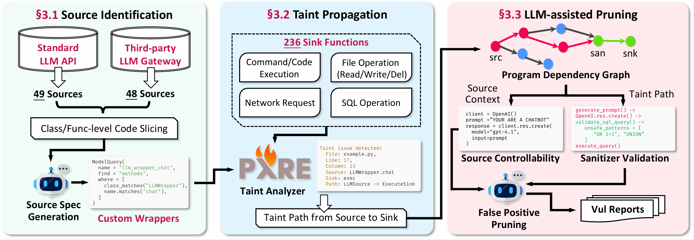

# TaintP2X

## 项目概述



本仓库实现了一种融合静态污点分析与大模型语义分析的静态分析框架。我们的方法通过分析LLM API到敏感函数的调用关系，结合大模型的语义理解能力，实现对P2Xi（Prompt-to-Anything Injection）问题的静态检测。

## 主要特点

基于 Pysa 的静态分析框架：
构建于开源框架 Pysa 之上，增强其跨函数污点传播能力，并针对 LLM 安全场景进行了定制化扩展。

智能污点源识别：
结合 AST 解析与语义推理，利用 LLM 自动生成结构化污点源规格，实现标准与自定义源的自动识别。

多层污点传播分析：
通过基于 CFG 的函数内分析、跨函数传播及结果交集融合，精确构建完整的源到汇传播路径。

LLM 辅助误报剪枝：
采用语义驱动的双阶段分析，通过源可控性分析与多轮 LLM 验证，有效识别真实可利用漏洞并减少误报。


## 项目结构

- `LLM-assisted_Validation/`: 包含与 LLM 辅助验证相关的模块，包括 `ds_llm_fully_determine_mul.py`、`ds_llm_source_determine_mul.py` 和 `extract_code_mul.py`。
- `Source_Identification/`: 包含用于源识别的模块，例如 `analyze_assignments.py`、`confirm_source.py` 和 `make_pysa_source.py`。
- `Taint_Propagation/`: 污点传播的核心模块，包括 Pyre 配置、各种库（例如 `anthropic.pyi`、`autogen.pyi`、`django/`、`openai.pyi`）的存根文件 (`stubs/`)，以及 Pysa 污点定义文件 (`taint/`)，如 `django_sinks.pysa`、`llms_sources.pysa` 和 `rce_sink.pysa`，其中包括使用的预定义LLM API表格`TaintP2X/Taint_Propagation/taint/llm_sources.xlsx`。
- `dataset/`: 包含实验的所有数据集。
- `project/`: 包含待测项目的目录。
- `pysa_result/`: 用于存储 Pysa 分析结果的目录。
- `run_download_and_check.py`: 用于下载和检查资源的脚本。
- `checked_repos.json` `test_source.json`: 其他项目文件。

## 安装

本项目需要安装pyre，链接https://pyre-check.org/docs/pysa-quickstart/


## 使用

使用`run_download_and_check.py`对项目进行检测。该脚本用于下载和初步检查项目。需要检测的项目可以在`test_source.json`中配置。

`test_source.json` 文件的格式如下：
```json
{
  "project_name_1": {
    "git_url": "https://github.com/owner/repo1.git",
    "commit_hash": "a1b2c3d4e5f67890a1b2c3d4e5f67890a1b2c3d4"
  },
  "project_name_2": {
    "git_url": "https://github.com/owner/repo2.git",
    "commit_hash": "b2c3d4e5f67890a1b2c3d4e5f67890a1b2c3d4e5"
  }
}
```
其中：
- `project_name_1`, `project_name_2` 等是您为项目定义的唯一名称。
- `git_url` 是项目的 Git 仓库地址。
- `commit_hash` 是要检测的特定提交的哈希值。

`run_download_and_check.py` 会根据 `test_source.json` 中的配置，将项目下载到 `dataset/real_world` 目录下，并进行初步检查。

使用`unified_analysis.py`对检测到的项目进行分析。该脚本会遍历 `PROJECT_NAMES` 中配置的项目，对每个项目执行污点分析和 DeepSeek LLM 辅助验证。

## 贡献

我们欢迎大家贡献代码！请随时提交 pull request 或提交 issue 来报告 bug 和提出功能建议。如有任何疑问或需要支持，请联系hjj@hust.edu.cn.

## 许可证

本项目采用 Apache 2.0 许可证授权 - 有关详细信息，请参阅 LICENSE 文件。